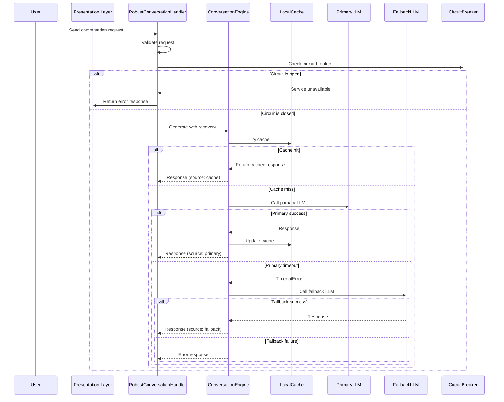

# Resilient Conversations - Repository Layout Plan

This document defines the repository structure for implementing robust error handling and graceful degradation in conversation systems, ensuring conversations don't exit unexpectedly without proper error notification.

## Table of Contents

1. [Repository Overview](#repository-overview)
2. [Directory Structure](#directory-structure)
3. [Core Implementation Files](#core-implementation-files)
4. [Error Handling Architecture](#error-handling-architecture)
5. [Testing Strategy](#testing-strategy)
6. [Monitoring & Observability](#monitoring--observability)
7. [Documentation Organization](#documentation-organization)
8. [Sample File Contents](#sample-file-contents)

---

## Repository Overview

**Purpose**: Implement a resilient conversation engine that gracefully handles failures across multiple layers (network, resource, application, infrastructure) without silent termination.

**Key Goals**:
- ✅ Never swallow exceptions silently
- ✅ Provide actionable error messages to users
- ✅ Implement automatic recovery with fallbacks
- ✅ Track metrics for error rates and recovery success
- ✅ Test error paths alongside happy paths

---

## Directory Structure

```
GPT_Mobile_AI-improved/
├── .github/
│   ├── workflows/
│   │   ├── ci.yml                    # CI pipeline with error handling tests
│   │   ├── error-simulations.yml     # Chaos engineering workflows
│   │   └── release.yml               # Release automation
│   └── ISSUE_TEMPLATE/
│       └── error-report.md           # Template for reporting conversation errors
│
├── app/
│   ├── src/
│   │   ├── main/
│   │   │   ├── java/
│   │   │   │   └── com/
│   │   │   │       └── gptmobileai/
│   │   │   │           ├── conversation/
│   │   │   │   │   ├── RobustConversationHandler.java    # Main entry point
│   │   │   │   │   ├── ConversationEngine.java           # Multi-layer recovery
│   │   │   │   │   ├── ConversationRequest.java
│   │   │   │   │   └── ConversationResponse.java
│   │   │   │   │
│   │   │   │   ├── error/
│   │   │   │   │   ├── ErrorClassification.java          # Error categorization
│   │   │   │   │   ├── ErrorTracker.java                  # Error logging
│   │   │   │   │   ├── CircuitBreaker.java                # Circuit breaker pattern
│   │   │   │   │   ├── RetryPolicy.java                   # Retry with backoff
│   │   │   │   │   ├── ErrorTemplates.java                # User-friendly error messages
│   │   │   │   │   └── ExceptionHandlers.java             # Per-layer handlers
│   │   │   │   │
│   │   │   │   ├── llm/
│   │   │   │   │   ├── PrimaryLLM.java                    # Primary LLM client
│   │   │   │   │   ├── FallbackLLM.java                   # Fallback LLM client
│   │   │   │   │   ├── LLMService.java                    # LLM orchestration
│   │   │   │   │   └── LLMErrors.java                     # LLM-specific errors
│   │   │   │   │
│   │   │   │   ├── cache/
│   │   │   │   │   ├── LocalCache.java                    # Response caching
│   │   │   │   │   └── CacheManager.java                  # Cache operations
│   │   │   │   │
│   │   │   │   ├── metrics/
│   │   │   │   │   ├── MetricsRegistry.java               # Metric collection
│   │   │   │   │   ├── ErrorMetrics.java                  # Error-specific metrics
│   │   │   │   │   └── PerformanceMetrics.java            # Latency metrics
│   │   │   │   │
│   │   │   │   ├── network/
│   │   │   │   │   ├── HttpClientConfig.java              # HTTP client config
│   │   │   │   │   ├── TimeoutHandler.java                # Timeout management
│   │   │   │   │   └── ConnectionPool.java                # Connection pooling
│   │   │   │   │
│   │   │   │   └── tracing/
│   │   │   │       ├── TraceContext.java                  # Distributed tracing
│   │   │   │       └── SpanManager.java                   # Span lifecycle
│   │   │   │
│   │   │   └── kotlin/
│   │   │       └── com/
│   │   │           └── gptmobileai/
│   │   │               └── ui/
│   │   │                   ├── ErrorDisplay.kt            # UI error notifications
│   │   │                   ├── RetryPrompt.kt              # Retry UI components
│   │   │                   └── DegradedState.kt            # Degraded mode UI
│   │   │
│   │   └── test/
│   │       ├── java/
│   │       │   └── com/
│   │       │       └── gptmobileai/
│   │       │           ├── conversation/
│   │       │           ├── error/
│   │       │           ├── llm/
│   │       │           ├── cache/
│   │       │           └── integration/
│   │       └── kotlin/
│   │           └── com/
│   │               └── gptmobileai/
│   │                   └── ui/
│   │                       └── ErrorDisplayTest.kt
│   │
│   └── schemas/
│       └── com.gptmobileai.conversation.*.db/
│           └── ConversationDatabaseSchema.db
│
├── docs/
│   ├── adr/
│   │   ├── 001-error-handling-architecture.md
│   │   ├── 002-circuit-breaker-implementation.md
│   │   ├── 003-graceful-degradation-strategy.md
│   │   └── 004-monitoring-stack.md
│   ├── agents/
│   │   └── conversation-agent.md
│   ├── error-handling/
│   │   ├── error-classification.md
│   │   ├── retry-strategies.md
│   │   ├── circuit-breaker.md
│   │   ├── fallback-mechanisms.md
│   │   └── error-templates.md
│   ├── resilience/
│   │   ├── root-causes.md
│   │   ├── layered-architecture.md
│   │   ├── metrics.md
│   │   └── alerting-rules.md
│   ├── testing/
│   │   ├── unit-tests.md
│   │   ├── integration-tests.md
│   │   └── chaos-engineering.md
│   ├── RESILIENT_CONVERSATIONS_LAYOUT.md  # This file
│   └── RESILIENT_CONVERSATIONS_IMPLEMENTATION.md  # Implementation guide
│
├── scripts/
│   ├── error-simulation/
│   │   ├── inject-network-latency.sh
│   │   ├── inject-service-down.sh
│   │   └── inject-context-overflow.sh
│   ├── testing/
│   │   ├── run-error-tests.sh
│   │   ├── run-chaos-tests.sh
│   │   └── generate-error-report.sh
│   └── monitoring/
│       ├── setup-alerts.sh
│       └── collect-metrics.sh
│
├── .github/
│   └── workflows/
│       └── error-handling-ci.yml
│
└── README.md
```

---

## Core Implementation Files

### 1. Conversation Layer

| File | Purpose | Key Features |
|------|---------|--------------|
| `RobustConversationHandler.java` | Main entry point with full error handling | Request validation, circuit breaker check, timeout wrapper, exception classification |
| `ConversationEngine.java` | Multi-layer recovery orchestrator | Cache → Primary LLM → Fallback LLM → Error response |
| `ConversationRequest.java` | Request data model | Prompt, history, user_id, session_id, max_tokens, temperature |
| `ConversationResponse.java` | Response data model | Content, status, source, error, suggestions, metadata |

### 2. Error Handling Layer

| File | Purpose | Key Features |
|------|---------|--------------|
| `ErrorClassification.java` | Error categorization | RETRYABLE, NON_RETRYABLE, CRITICAL error types |
| `ErrorTracker.java` | Error logging | Per-user, per-session, per-error-type tracking |
| `CircuitBreaker.java` | Circuit breaker pattern | Failure threshold, recovery timeout, half-open state |
| `RetryPolicy.java` | Retry with exponential backoff | Configurable attempts, backoff multiplier, jitter |
| `ErrorTemplates.java` | User-friendly error messages | Pre-defined templates with suggestions and retry delays |
| `ExceptionHandlers.java` | Per-layer exception handlers | Network, LLM, cache, resource exhaustion handlers |

### 3. LLM Layer

| File | Purpose | Key Features |
|------|---------|--------------|
| `PrimaryLLM.java` | Primary LLM client | Timeout config, streaming support, token counting |
| `FallbackLLM.java` | Fallback LLM client | Smaller model, reduced context, local fallback |
| `LLMService.java` | LLM orchestration | Model selection, cost optimization, quality scoring |
| `LLMErrors.java` | LLM-specific errors | Context exceeded, rate limited, model unavailable |

### 4. Cache Layer

| File | Purpose | Key Features |
|------|---------|--------------|
| `LocalCache.java` | Response caching | TTL-based expiration, size limits, LRU eviction |
| `CacheManager.java` | Cache operations | Get, set, invalidate, statistics |

### 5. Metrics Layer

| File | Purpose | Key Features |
|------|---------|--------------|
| `MetricsRegistry.java` | Metric collection | Conversations, errors, performance, recovery metrics |
| `ErrorMetrics.java` | Error-specific metrics | Error rates, recovery rates, error types |
| `PerformanceMetrics.java` | Latency metrics | P50, P95, P99 latencies, time to first token |

### 6. Network Layer

| File | Purpose | Key Features |
|------|---------|--------------|
| `HttpClientConfig.java` | HTTP client configuration | Timeout, connection pool, SSL settings |
| `TimeoutHandler.java` | Timeout management | Request timeout, stream timeout, overall timeout |
| `ConnectionPool.java` | Connection pooling | Max connections, keep-alive, idle timeout |

### 7. Tracing Layer

| File | Purpose | Key Features |
|------|---------|--------------|
| `TraceContext.java` | Distributed tracing | Trace ID propagation, span correlation |
| `SpanManager.java` | Span lifecycle | Span creation, attribute setting, status reporting |

---

## Error Handling Architecture

### Layered Error Handling

```
┌─────────────────────────────────────────────────────────────┐
│                    Presentation Layer                         │
│  (UI/CLI) → User-friendly messages, retry prompts           │
│  Files: ErrorDisplay.kt, RetryPrompt.kt, DegradedState.kt   │
├─────────────────────────────────────────────────────────────┤
│                   Application Layer                           │
│  (Business logic) → Context-aware recovery, fallbacks       │
│  Files: RobustConversationHandler.java, ConversationEngine.java │
├─────────────────────────────────────────────────────────────┤
│                    Service Layer                              │
│  (API/Orchestration) → Request validation, timeout handling  │
│  Files: LLMService.java, TimeoutHandler.java                 │
├─────────────────────────────────────────────────────────────┤
│                   Infrastructure Layer                        │
│  (LLM API, Network) → Retry logic, circuit breakers          │
│  Files: CircuitBreaker.java, RetryPolicy.java, LLMErrors.java │
└─────────────────────────────────────────────────────────────┘
```

### Error Flow



---

## Testing Strategy

### Unit Test Structure

```
app/src/test/
├── java/
│   └── com/
│       └── gptmobileai/
│           ├── conversation/
│           │   ├── RobustConversationHandlerTest.java
│           │   ├── ConversationEngineTest.java
│           │   ├── ConversationRequestTest.java
│           │   └── ConversationResponseTest.java
│           ├── error/
│           │   ├── ErrorClassificationTest.java
│           │   ├── ErrorTrackerTest.java
│           │   ├── CircuitBreakerTest.java
│           │   ├── RetryPolicyTest.java
│           │   └── ErrorTemplatesTest.java
│           ├── llm/
│           │   ├── PrimaryLLMTest.java
│           │   ├── FallbackLLMTest.java
│           │   └── LLMServiceTest.java
│           ├── cache/
│           │   ├── LocalCacheTest.java
│           │   └── CacheManagerTest.java
│           └── integration/
│               ├── FullConversationFlowTest.java
│               └── ErrorRecoveryTest.java
└── kotlin/
    └── com/
        └── gptmobileai/
            └── ui/
                └── ErrorDisplayTest.kt
```

### Integration Test Scenarios

| Test Name | Scenario | Expected Behavior |
|-----------|----------|-------------------|
| `test_timeout_retry` | LLM request times out twice then succeeds | 3 attempts, success on 3rd |
| `test_fallback_activation` | Primary LLM fails with connection error | Fallback LLM used |
| `test_context_exceeded` | Conversation history too long | Graceful truncation with user notification |
| `test_circuit_breaker_open` | 5 consecutive failures | Circuit opens, returns service unavailable |
| `test_cache_hit` | Same prompt requested twice | Second request served from cache |
| `test_rate_limit_handling` | API returns 429 | Retry after delay, then fallback |
| `test_graceful_degradation` | All layers fail | User gets helpful error message |

---

## Monitoring & Observability

### Metrics to Track

```yaml
metrics:
  conversations:
    - total_conversations_total
    - successful_conversations_total
    - failed_conversations_total
    - aborted_conversations_total
    - conversation_duration_seconds
    - conversation_errors_total
    - conversation_source_count {source: "primary", "fallback", "cache", "error"}
  
  errors:
    - errors_total
    - errors_by_type {error_type: "TIMEOUT", "CONNECTION_ERROR", "CONTEXT_EXCEEDED", ...}
    - errors_by_recovery {recovery: "retry", "fallback", "cache", "none"}
    - errors_by_user_segment {segment: "free", "premium"}
    - errors_by_session {session_id: "..."}
  
  performance:
    - latency_p50_seconds
    - latency_p95_seconds
    - latency_p99_seconds
    - time_to_first_token_seconds
    - time_to_full_response_seconds
  
  recovery:
    - retries_total
    - fallbacks_used_total
    - cache_hits_total
    - cache_misses_total
    - circuit_breaker_state {state: "closed", "open", "half_open"}
```

### Alerting Rules

| Alert Name | Condition | Severity | Action |
|------------|-----------|----------|--------|
| High Error Rate | error_rate > 5% for 5 min | Critical | Page on-call |
| Circuit Breaker Open | circuit_breaker_open > 0 for 10 min | Warning | Notify team |
| Unusual Abortion Rate | abort_rate > 3% for 15 min | Warning | Investigate |
| Cache Hit Rate Low | cache_hit_rate < 10% for 1h | Info | Optimize caching |
| P99 Latency Spike | latency_p99 > 5s for 5 min | Warning | Performance review |

---

## Documentation Organization

### ADRs (Architecture Decision Records)

| File | Decision | Rationale |
|------|----------|-----------|
| `001-error-handling-architecture.md` | Layered error handling | Isolation of concerns, clear boundaries |
| `002-circuit-breaker-implementation.md` | Circuit breaker for LLM | Prevent cascading failures |
| `003-graceful-degradation-strategy.md` | Multi-layer fallback | Always have a fallback option |
| `004-monitoring-stack.md` | Metrics and alerting | Early detection of issues |

### Error Handling Docs

| File | Content |
|------|---------|
| `error-handling/error-classification.md` | Error types and handling strategies |
| `error-handling/retry-strategies.md` | Retry policies and backoff algorithms |
| `error-handling/circuit-breaker.md` | Circuit breaker configuration and tuning |
| `error-handling/fallback-mechanisms.md` | Fallback options and selection logic |
| `error-handling/error-templates.md` | User-friendly error message templates |

### Resilience Docs

| File | Content |
|------|---------|
| `resilience/root-causes.md` | Root cause analysis of common failures |
| `resilience/layered-architecture.md` | Layered error handling design |
| `resilience/metrics.md` | Metrics collection and reporting |
| `resilience/alerting-rules.md` | Alert configuration and thresholds |

### Testing Docs

| File | Content |
|------|---------|
| `testing/unit-tests.md` | Unit test structure and examples |
| `testing/integration-tests.md` | Integration test scenarios |
| `testing/chaos-engineering.md` | Chaos testing methodology |

---

## Sample File Contents

### RobustConversationHandler.java

```java
package com.gptmobileai.conversation;

import com.gptmobileai.error.*;
import com.gptmobileai.llm.*;
import com.gptmobileai.cache.LocalCache;
import com.gptmobileai.metrics.MetricsRegistry;

public class RobustConversationHandler {
    
    private final LLMService llmService;
    private final CircuitBreaker circuitBreaker;
    private final LocalCache cache;
    private final MetricsRegistry metrics;
    
    public RobustConversationHandler(LLMService llmService) {
        this.llmService = llmService;
        this.circuitBreaker = CircuitBreaker.builder()
            .failureThreshold(5)
            .recoveryTimeout(30, TimeUnit.SECONDS)
            .build();
        this.cache = new LocalCache(10000, 300, TimeUnit.SECONDS);
        this.metrics = MetricsRegistry.getInstance();
    }
    
    public ConversationResponse handle(ConversationRequest request) {
        // Validate request
        if (!validateRequest(request)) {
            return ConversationResponse.error("INVALID_REQUEST", request);
        }
        
        // Check circuit breaker
        if (!circuitBreaker.isClosed()) {
            metrics.recordError("CIRCUIT_BREAKER_OPEN");
            return ConversationResponse.degraded("Service temporarily unavailable. Please try again shortly.");
        }
        
        try {
            // Execute with timeout
            return llmService.generateWithRecovery(request);
        } catch (TimeoutError e) {
            metrics.recordError("TIMEOUT");
            return ConversationResponse.error("TIMEOUT", "Request timed out. Please try again.");
        } catch (ContextExceededError e) {
            metrics.recordError("CONTEXT_EXCEEDED");
            return ConversationResponse.error("CONTEXT_EXCEEDED", "Conversation history is too long. Some details may be lost.");
        } catch (Exception e) {
            metrics.recordError("UNEXPECTED_ERROR", e);
            return ConversationResponse.error("UNEXPECTED_ERROR", "An unexpected error occurred. Please try again.");
        }
    }
}
```

### ErrorTemplates.java

```java
package com.gptmobileai.error;

import java.util.List;
import java.util.Map;

public class ErrorTemplates {
    
    public static final Map<String, ErrorTemplate> TEMPLATES = Map.of(
        "TIMEOUT", new ErrorTemplate(
            "⏱️ The response took too long. This might be due to high traffic. Please try again.",
            List.of("Try rephrasing your question", "Break your question into smaller parts", "Check your internet connection"),
            30L
        ),
        "CONTEXT_EXCEEDED", new ErrorTemplate(
            "📝 Your conversation history is too long. Some details may be lost.",
            List.of("Summarize key points", "Start a new conversation thread", "Refer to earlier messages directly"),
            null
        ),
        "RATE_LIMITED", new ErrorTemplate(
            "🚫 Too many requests. Please wait before trying again.",
            List.of(),
            60L
        ),
        "MODEL_UNAVAILABLE", new ErrorTemplate(
            "🔧 The model is temporarily unavailable. Please try again shortly.",
            List.of(),
            60L
        )
    );
    
    public static String getMessage(String errorType) {
        ErrorTemplate template = TEMPLATES.get(errorType);
        return template != null ? template.getMessage() : "An error occurred. Please try again.";
    }
    
    public static List<String> getSuggestions(String errorType) {
        ErrorTemplate template = TEMPLATES.get(errorType);
        return template != null ? template.getSuggestions() : List.of();
    }
    
    public static long getRetryAfter(String errorType) {
        ErrorTemplate template = TEMPLATES.get(errorType);
        return template != null ? template.getRetryAfter() : 0L;
    }
}
```

### CircuitBreaker.java

```java
package com.gptmobileai.error;

import java.util.concurrent.atomic.AtomicInteger;

public class CircuitBreaker {
    private final int failureThreshold;
    private final long recoveryTimeoutSeconds;
    private final int halfOpenRequests;
    private final AtomicInteger failureCount;
    private final AtomicInteger state; // 0=closed, 1=open, 2=half_open
    private long lastFailureTime;
    
    public CircuitBreaker(int failureThreshold, long recoveryTimeoutSeconds, int halfOpenRequests) {
        this.failureThreshold = failureThreshold;
        this.recoveryTimeoutSeconds = recoveryTimeoutSeconds;
        this.halfOpenRequests = halfOpenRequests;
        this.failureCount = new AtomicInteger(0);
        this.state = new AtomicInteger(0);
    }
    
    public synchronized boolean isClosed() {
        return state.get() == 0;
    }
    
    public synchronized boolean execute(Runnable action) {
        if (state.get() == 1) { // Open
            return false;
        }
        
        try {
            action.run();
            success();
            return true;
        } catch (Exception e) {
            failure();
            return false;
        }
    }
    
    private void success() {
        if (state.get() == 2) { // Half-open
            state.set(0);
            failureCount.set(0);
        }
    }
    
    private void failure() {
        failureCount.incrementAndGet();
        lastFailureTime = System.currentTimeMillis();
        
        if (failureCount.get() >= failureThreshold) {
            state.set(1); // Open
        }
    }
    
    private void checkRecovery() {
        if (state.get() == 1 && System.currentTimeMillis() - lastFailureTime > recoveryTimeoutSeconds * 1000) {
            state.set(2); // Half-open
            failureCount.set(0);
        }
    }
}
```

---

## Next Steps

1. **Phase 1**: Set up base structure (directories, gradle modules)
2. **Phase 2**: Implement core conversation handling
3. **Phase 3**: Add error handling layer
4. **Phase 4**: Implement LLM service with fallbacks
5. **Phase 5**: Add caching and metrics
6. **Phase 6**: Write tests
7. **Phase 7**: Set up CI/CD with chaos testing
8. **Phase 8**: Deploy and monitor

For detailed implementation guidance, see `docs/RESILIENT_CONVERSATIONS_IMPLEMENTATION.md`.
