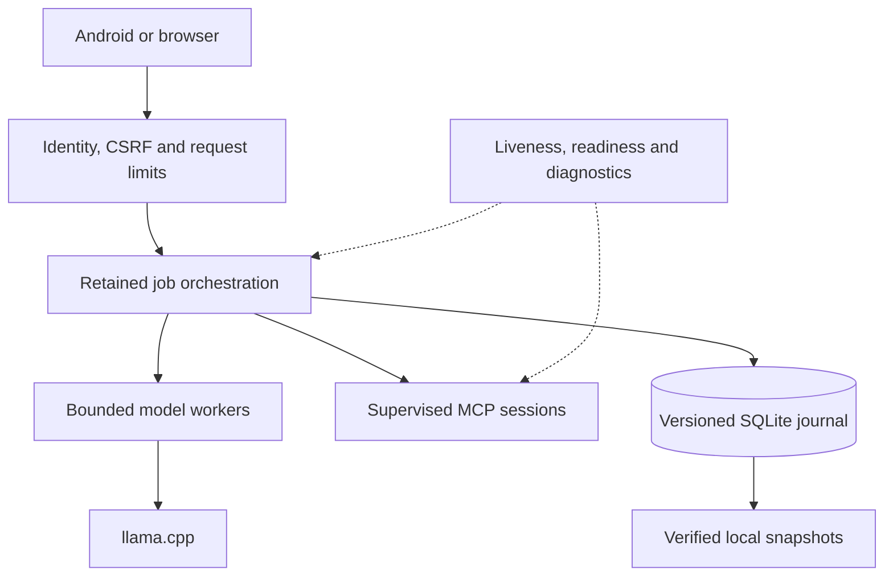

# Gateway v14.1: stability architecture and proposed next steps

Research reviewed October 9, 2026 (America/Toronto). This document describes the implemented v14.1 foundation and separates it from future work. The target is the existing Windows PC gateway with an Android/browser client, llama.cpp and local MCP processes.

## Architectural decision

Keep one gateway process and local SQLite. Introduce explicit admission, persistence, transport and lifecycle boundaries around the characterized v13 execution engine. Do not introduce Redis, Kubernetes, a cloud queue or a new phone service for this deployment. Those additions would add operating requirements without addressing the failures observed here. This is an engineering judgment for this installation, not a universal architecture recommendation.

The retained orchestration engine remains large and stateful. v14.1 is an incremental reliability release, not a completed rewrite. Each boundary has failure tests so later extraction can preserve behavior.



## Findings and delivered changes

| Finding in the previous gateway | v14.1 implementation | Practical limit or tradeoff |
| --- | --- | --- |
| Existing tables could differ from the expected schema | Named schema revision, schema validation, transaction-based timestamp upgrade, startup integrity check and refusal of unsupported future revisions | Retained recovery and retention logic still runs after validation |
| WAL used NORMAL synchronization | FULL on every journal connection | Additional commit I/O; actual hardware durability still depends on the storage stack |
| Upgrades had no automatic recovery snapshot | SQLite backup API before upgrading an existing unversioned journal; verify snapshot and abort upgrade if saving fails | Snapshot is local and unencrypted; it contains the job journal, not a complete credentials/ownership export |
| Model work and incoming chat streams had no explicit application capacity limit | Separate worker and request limits; total upload deadline; body-byte limit that counts received bytes even without Content-Length | Duplicate callers use a stream slot; excess work returns a clear busy error instead of an unlimited queue |
| Shutdown cleanup relied heavily on process exit hooks | Lifespan starts storage before serving, drains admission, signals active workers, waits a bounded grace interval and closes MCP sessions | Python cannot forcibly stop an arbitrary worker thread; retained model network deadlines remain necessary |
| MCP stdout used unbounded line reads and a growing queue | Bounded line reads, bounded queued messages and process termination on overflow | A noisy/broken server loses its current connection |
| Unrelated MCP messages extended inactivity timers | Only progress for the current request extends inactivity; a hard deadline remains | Queue wait consumes the request deadline; a deadline watchdog also releases blocked call writes by killing the child |
| Timeout handling restarted processes immediately and discovery had another retry layer | Lazy reconnection, one per-session circuit breaker and no automatic RPC/tool replay | A transient tool failure is surfaced; automatic safe-read retries are deliberately disabled until explicit idempotency policies exist |
| Null-ID notifications and server requests were misclassified as unexpected responses | Tolerate legacy null-ID notifications; answer legacy ping; reject ungranted client capabilities explicitly | Compatibility tolerance does not advertise sampling or elicitation |
| Unsupported negotiated MCP versions were accepted | Validate an explicit set of legacy revisions and report unsupported modern revisions | Modern 2026-07-28 MCP is not implemented in this release |
| Readiness checked only the model backend | Separate liveness, readiness including journal state, and local diagnostics with connection circuit state | Optional MCP outages do not mark all basic chat unavailable |
| Progress persistence failure could leave unsaved state in memory | Restore event history, sequence and public fields on failed progress commit; prevent reopening terminal jobs | Distributed exactly-once effects are still not promised |
| Malformed tool definitions could break catalog filtering | Quarantine malformed entries while preserving usable tools | Full JSON Schema argument validation is still future work |
| Release checks were mainly local | A single check command and a Windows/Linux, Python 3.12/3.13 CI matrix | Adding CI is not evidence that the Windows jobs or a physical phone have passed |
| Windows Git checkout changed line endings and invalidated package hashes | Gateway files are explicitly checked out as LF; source-reading tests and captured process output use UTF-8 | Exact-byte hash validation remains enforced; modified files still fail validation |

## Why these choices follow the research

SQLite distinguishes database consistency from durability across power loss. Its WAL documentation and synchronous pragma describe the extra commit synchronization performed by FULL. The Online Backup API provides a consistent snapshot that includes committed WAL state; copying only the main database file is not the chosen backup mechanism. [SQLite synchronization](https://sqlite.org/pragma.html#pragma_synchronous), [WAL](https://www.sqlite.org/wal.html), [backup API](https://sqlite.org/backup.html).

ASGI lifespan provides a place for startup checks and teardown. Uvicorn documents explicit resource limits and overload responses. The gateway applies separate limits to chat admission and actual workers so a model overload does not consume the same capacity as a liveness request. [Starlette lifespan](https://starlette.dev/lifespan/), [Uvicorn resource limits](https://www.uvicorn.org/server-behavior/).

MCP's legacy lifecycle guidance calls for request timeouts and an absolute maximum even when progress is arriving. Cancellation is best effort: it does not prove that a remote action never happened. The gateway therefore closes a failed transport without automatically replaying a tool. AWS's idempotency guidance independently explains why retrying operations with side effects can duplicate those effects. [MCP legacy lifecycle](https://modelcontextprotocol.io/specification/2025-11-25/basic/lifecycle), [MCP cancellation](https://modelcontextprotocol.io/specification/2025-11-25/basic/utilities/cancellation), [AWS idempotent retries](https://aws.amazon.com/builders-library/making-retries-safe-with-idempotent-APIs/).

Current MCP documentation distinguishes the modern per-request metadata model from legacy initialize-based sessions. A correct dual-era stdio adapter probes with server/discover, distinguishes recognized modern errors and handles fallback rules. Changing only a protocolVersion string is insufficient. v14.1 validates legacy revisions and leaves the modern capability false. [MCP versioning](https://modelcontextprotocol.io/specification/2026-07-28/basic/versioning), [MCP stdio](https://modelcontextprotocol.io/specification/2026-07-28/basic/transports/stdio), [server discovery](https://modelcontextprotocol.io/specification/2026-07-28/server/discover).

## Defaults and operational interfaces

| Setting | Default | Meaning |
| --- | --- | --- |
| GATEWAY_MAX_ACTIVE_CHATS | 8 | Concurrent admitted chat requests, including streams |
| GATEWAY_MAX_WORKERS | 2 | Concurrent retained orchestration/model workers |
| GATEWAY_MAX_BODY_BYTES | 16777216 | Maximum incoming chat body, including encoded images |
| GATEWAY_BODY_TIMEOUT | 30 | Seconds to receive the complete chat body |
| GATEWAY_SHUTDOWN_GRACE | 10 | Seconds allowed for cooperative worker drain |
| Existing MCP timeoutSeconds | Existing server/runtime value | Current-request inactivity deadline |
| Existing MCP absoluteTimeoutSeconds | Existing server/runtime value, capped at 900 seconds | Queue, startup and call deadline |
| MCP circuit threshold/cooldown | 3 failures / 30 seconds | Per configured connection; one recovery probe after cooldown |
| MCP buffered messages | 128 plus one terminal notice; 8 MiB serialized data | Per process output queue; parsed Python objects have additional overhead |

An individual MCP stdout line is capped at 4 MiB characters. Stderr is drained in bounded chunks and is not copied into gateway logs. Consult the server directly for its detailed startup diagnostics.

GET /gateway/live answers without a model or MCP probe. GET /gateway/ready returns HTTP 503 when draining, when the journal is unavailable or its last write failed, or when the model health probe fails. A subsequent successful journal write clears the write-failure state. Readiness does not repair storage. GET /gateway/admin/status reports local-only operational state without credentials, prompts or raw tool output. Existing identity, Host/Origin and CSRF admission still applies.

Busy requests return HTTP 503 with Retry-After when rejected at admission. If worker capacity is exhausted after a stream has started, the client receives the existing SSE error format; the gateway cannot change an already-sent HTTP status. Oversized bodies return 413 and expired uploads return 408. Accepted chat responses include a generated X-Gateway-Trace-ID. This is correlation metadata, not a complete distributed tracing backend.

Job snapshots are created under the database's sibling backups directory before its first v14.1 schema upgrade. They are intentionally retained rather than automatically deleted. Operators should apply their normal local backup retention policy. A snapshot command is also available:

```powershell
.\.venv\Scripts\python.exe gateway.py backup-journal --output D:\MCP\backups\jobs-before-upgrade.sqlite3
```

The command refuses an existing destination and opens its source read-only. A missing source is an error; it does not silently create an empty database. It never migrates, prunes or restores the live database.

## Validation and installation

```powershell
.\.venv\Scripts\python.exe gateway.py validate-config
.\.venv\Scripts\python.exe check_gateway.py
```

The check command requires Node for the browser bridge tests. It runs legacy Python suites in separate processes and the v14 integration/fault suites together. Tests exercise real SQLite, committed WAL snapshots, unsupported schema revisions, failed backups, locked databases, progress rollback, terminal job protection, process-crash recovery, body limits, overload, drain, real subprocess MCP framing, idle/absolute deadlines, oversized output, cancellation, protocol mismatch and circuit recovery. A real Uvicorn subprocess test covers HTTP startup, browser admission, model transport, streaming and saved-result retrieval against a local simulated llama backend. Model inference remains simulated. No live GitHub write or external tool action is used in the fault tests.

Local validation: **160 checks passed** on Linux/Python 3.12 (63 v14 Python tests, 90 retained regressions and 7 browser JavaScript tests). Windows matrix execution, real llama.cpp/model behavior, Android compilation and physical-phone acceptance remain pending.

Update a complete package; retain the existing database, authentication database, custom configuration and virtual environment. The staged installer reads the version from the manifest. Stop the active gateway before switching the launch target. Validate a normal chat, cancellation, recovery and a read-only MCP call on Windows before making the new release the usual launcher. To roll back, stop it and select the prior release with a coherent saved state snapshot; do not overwrite an open SQLite database.

## Proposed next phases — not implemented here

1. **Durable action ledger and idempotency keys.** Persist principal, stable request ID, canonical request hash, tool binding, dispatch state and outcome before a side effect. Same key with a different payload must return a conflict. An uncertain remote outcome must require reconciliation, not blind replay. This is a separate protocol change for the Android client and gateway.
2. **Modern MCP adapter.** Implement the official server/discover probe and per-request metadata; keep an independent tested legacy adapter. Include modern errors, structured results, input-required continuations, cancellation and subscriptions in a cross-era fixture matrix. Add HTTP transport only with origin-bound sessions and authorization tests.
3. **Extract orchestration from the retained engine.** Move typed job transitions and worker ownership into a dedicated supervisor, use bounded executors, and move remaining synchronous database work off the ASGI event loop. A gateway-wide deadline must cover model calls, tool calls, writes and delivery without resetting at each stage.
4. **Unified browser/Android recovery.** Map browser conversation recovery and Android job/event cursors to one principal-scoped event contract. Include replay gaps, completed-result recovery, Last-Event-ID support and client disconnect tests. The llama.cpp /tools 404 is a separate backend compatibility issue and remains visible.
5. **Deployment certification.** Run Windows install/rollback, a prolonged mixed workload, forced process termination, disk exhaustion, Tailscale identity checks and physical-phone acceptance. Measure p50/p95 latency, active worker count, memory growth, MCP restarts and journal size. Only then label a release production-certified.

## Deliberate boundaries

Run a single gateway process per state directory. Multi-process coordination, encrypted journal contents, automatic restore, complete auth/job/config export, a native MCP facade and modern MCP support are not provided here. A circuit breaker reduces repeated connection failures; it does not undo an external action or guarantee that a server honored cancellation. Stronger SQLite synchronization is not a measured speed improvement. These constraints are reflected in the capability response and release notes.
