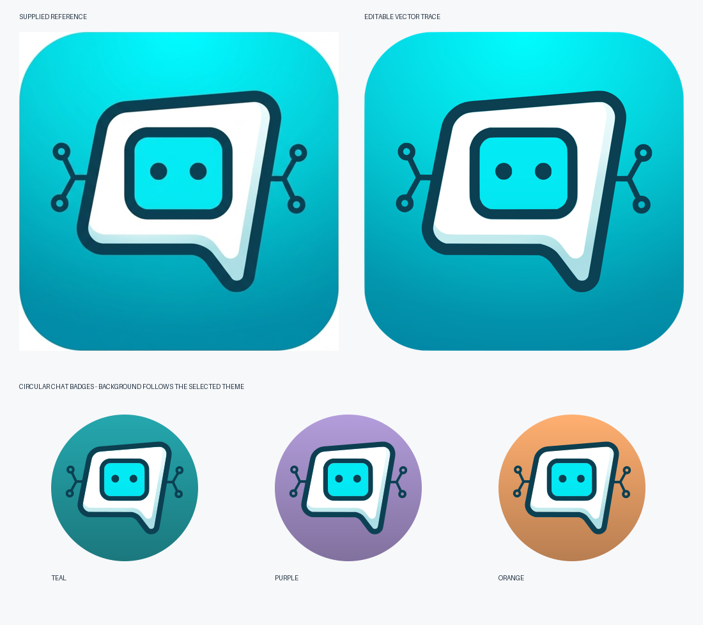

# App icon artwork

`app-icon.svg` is the editable vector master traced from the supplied 1536 × 1536
reference (`52372.jpg`). Its viewport crops away the photograph's white margin.
The artwork contains only Bézier paths and gradients, with no embedded bitmap,
font, filter, external resource, or runtime image download.

The traced contours retain the reference's asymmetric speech panel, rounded tail,
face frame, eyes, branching circuit arms and four hollow terminals. Separate white
and pale shaded surfaces preserve the lower/right lip. The turquoise background
uses fitted linear and radial gradients. The navy contours and cyan face also
have their own colour gradients. JPEG compression noise is not part of the logo.

## Android variants

- `ic_app_emblem`: the complete, untinted emblem used by `ThemedAppIcon`.
- `ic_gpt_mobile`: the reference rounded tile.
- `ic_gpt_mobile_no_padding`: the circular reference-colour badge.
- `ic_gpt_mobile_foreground`: the same emblem fitted uniformly to the adaptive
  launcher safe circle; also used by the existing splash resource.
- `ic_gpt_mobile_monochrome_foreground`: the same contour and eye paths, including
  transparent panel/face/terminal openings, for system themed icons and notifications.
- `ic_gpt_mobile_background_layer`: full-bleed reference gradients; the Android
  launcher chooses its own outer mask.

Chat, tool traces and the start screen share `ThemedAppIcon`. Only the circular
background follows `MaterialTheme.colorScheme.primary`. The emblem keeps its
reference colours and shading. A single scale based on the shorter dimension
centres the entire badge in wide or tall bounds without making an ellipse.
Android launchers control their own icon mask and system tint independently of
the app's selected colour theme.

## Regeneration

```bash
python3 scripts/generate_app_icon.py
python3 scripts/generate_app_icon.py --check
# Refresh the README and store PNG exports (requires Inkscape):
python3 scripts/generate_app_icon.py --png
```

The resource validation entry point runs `--check` to prevent generated assets
from drifting away from the SVG. Raster exports are only for the README/store;
all runtime artwork remains vector.

## Visual review



This is a rendered artwork proof, not an on-device screenshot. The native-scale
comparison was made against the supplied reference crop. The adaptive foreground
fits within the 33 dp safe radius, including the complete terminal outlines and
speech tail. Gradients and path rendering have been visually inspected; Android
resource compilation and device rendering still require the normal CI/device checks.
